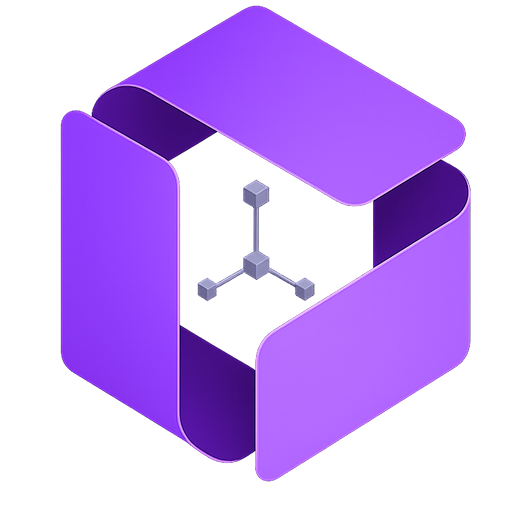

<div align="center">



<br />
<br />


</div>

<br />

<p align="center">
  
</p>

<p align="center">
  <i>Visual 3D component editing, blueprint persistence, animation, and TypeScript export.</i>
</p>

# 3Forge

3Forge is a desktop-first 3D authoring editor built with `Three.js`, `React`, and `TypeScript`.

It lets you compose reusable 3D components visually, save them as serializable blueprints, and export production-ready TypeScript code for `three` runtimes.

## Why It Exists

3Forge is designed for teams and developers who need a practical bridge between visual scene editing and code-driven 3D workflows.

Instead of hand-authoring every mesh, transform, material, image, font, binding, and animation track, you can assemble the component in the editor and export a structured runtime class that can be integrated into a `three` application.

## Current Capabilities

- Desktop-style editor shell with scene graph, viewport, inspector, assets, runtime fields, timeline, and toolbar.
- Hierarchical scene graph editing with groups, child nesting, pivots, alignment helpers, and selection bounds.
- Transform editing for position, rotation, and scale, including drag-adjustable numeric fields.
- Geometry authoring for boxes, spheres, cylinders, planes, circles, images, and 3D text.
- Reusable material registry with material assignment and right-column material editing.
- Asset workflow for imported images, local fonts, reusable materials, and generated package assets.
- Runtime-editable bindings for component options.
- Blueprint JSON import/export for project persistence.
- Export package generation with blueprint JSON, TypeScript, and referenced assets.
- TypeScript export that rebuilds the scene in `three`.
- GSAP-powered runtime animation API in exported TypeScript.
- Editor animation preview with tracks, keyframes, channels, clip selection, seek/playback controls, and timeline zoom/scroll.
- Blender-style pie menus for tool and view-mode selection.
- Export runner playground for validating generated TypeScript exports outside the main editor.
- PWA build support through Vite.

## How It Works

The editor's source of truth is a serializable `blueprint`.

A blueprint stores:

- component metadata
- fonts and image assets
- reusable material definitions
- node hierarchy
- transforms, pivots, geometry, and material assignments
- editable runtime bindings
- animation clips, tracks, keyframes, easing, and timeline configuration

The React UI edits the blueprint. The Three.js scene reflects it. The export pipeline uses the same blueprint to generate persistence and runtime outputs.

## Export Model

### Blueprint JSON

Blueprint JSON is the persistence format.

Use it to:

- save and reopen projects
- version scene definitions
- move components between environments
- preserve editable state for later authoring

### Export Package

The package export creates a ZIP containing:

- the generated TypeScript component
- the blueprint JSON
- referenced font assets
- referenced image assets

This is the preferred export format when the component uses external fonts or image files.

### Generated TypeScript

The TypeScript export is the runtime integration format.

The generated class:

- creates a root `Group`
- rebuilds the node hierarchy
- instantiates geometries, materials, images, and text
- applies transforms, pivots, visibility, and shadows
- exposes runtime options from editable bindings
- provides `build()` and `dispose()` lifecycle methods
- exposes animation methods when animation clips exist

Animation export continues to use GSAP so runtime playback remains portable and familiar:

- `getClipNames()`
- `createTimeline()`
- `playClip()`
- `play()`
- `pause()`
- `restart()`
- `reverse()`
- `stop()`
- `seek()`

## Tech Stack

- `React 19`
- `Three.js`
- `TypeScript`
- `GSAP`
- `Vite`
- `Vitest`
- `React Testing Library`
- `JSZip`

## Project Structure

```text
.
|-- documents/
|   |-- demo.gif
|   `-- FEATURES/
|-- playgrounds/
|   `-- export-runner/
|       |-- src/
|       |   |-- generated/
|       |   |-- ExportRunnerApp.tsx
|       |   `-- runtime.ts
|       `-- vite.config.mjs
|-- public/
|   `-- assets/
|       |-- fonts/
|       `-- web/
|-- scripts/
|   `-- vite-wrapper.mjs
|-- src/
|   `-- editor/
|       |-- animation.ts
|       |-- exportPackage.ts
|       |-- exports.ts
|       |-- scene.ts
|       |-- state.ts
|       |-- types.ts
|       |-- workspace.ts
|       `-- react/
|           |-- App.tsx
|           |-- components/
|           `-- hooks/
|-- index.html
|-- package.json
|-- tsconfig.json
`-- vite.config.mjs
```

## Local Development

### Requirements

- `Node.js >= 22.12.0`
- `npm`

This repository includes an `.nvmrc` file. If you use `nvm`, run:

```bash
nvm use
```

### Install

```bash
npm install
```

### Run The Editor

```bash
npm run dev
```

### Production Build

```bash
npm run build
```

### Preview The Production Build

```bash
npm run preview
```

### Tests And Validation

```bash
npm run test
npm run typecheck
npm run validate
```

For local test iteration:

```bash
npm run test:watch
```

## Export Runner Playground

The export runner is a separate playground app for validating generated TypeScript exports without mixing that workflow into the main editor UI.

Run it with:

```bash
npm run dev:export-runner
```

Build it with:

```bash
npm run build:export-runner
```

Preview it with:

```bash
npm run preview:export-runner
```

Recommended workflow:

1. Export a component package from the editor.
2. Extract the ZIP into:

```text
playgrounds/export-runner/src/generated/
```

3. Keep the generated `.ts` file and its `assets/` directory together.
4. Start or restart the runner.
5. Choose the generated file, click `Build export`, and test runtime options or animation methods.

The runner serves `src/generated` as its public asset root, so exports that reference `./assets/...` continue to work in the playground.

## Editor Workflow

Typical usage:

1. Create or load a project.
2. Build the scene using the viewport and scene graph.
3. Add primitives, images, text, groups, and reusable materials.
4. Adjust transforms, pivots, geometry, material settings, shadows, and visibility.
5. Mark properties as editable when runtime overrides are needed.
6. Create animation clips and add tracks/keyframes in the timeline.
7. Validate behavior in the editor.
8. Export blueprint JSON, TypeScript, or a packaged ZIP.
9. Optionally validate the generated TypeScript in the export runner.

## Animation System

Animation data is stored in the blueprint as serializable clips, tracks, and keyframes.

The editor preview applies animation directly to the Three.js scene for responsive playback. The TypeScript export emits GSAP timelines and animation control methods for runtime integration.

Supported animated properties include:

- `transform.position.x/y/z`
- `transform.rotation.x/y/z`
- `transform.scale.x/y/z`
- `visible`

Timeline behavior includes:

- channel rows with property-specific icons
- left-side channels and right-side keyframe lanes
- ruler aligned to the keyframe lanes
- vertical scrolling for many channels
- horizontal scrolling for long timelines
- `Ctrl/Cmd + wheel` zoom
- `Shift + wheel` horizontal pan

## UI Direction

3Forge follows a dense, dark, professional editor design language.

- The viewport is the primary workspace.
- Side panels provide operational tooling around the scene.
- Purple is the product accent and selection color.
- Toolbar, pie menus, panels, custom selects, and numeric controls should stay compact and tool-like.
- The editor is desktop-first, with responsive handling where supported.

Project-specific UI guidance for agents lives in:

```text
.agents/skills/3forge-ui-ux/
```

## Documentation

Functional documentation is kept in:

```text
documents/FEATURES/
```

Important references:

- `documents/PROJECT.md`
- `documents/FEATURES/README.md`
- `documents/FEATURES/EXPORT_OPTIMIZATION.md`
- `documents/FEATURES/TYPESCRIPT_EXPORT_RUNNER.md`
- `documents/FEATURES/EDITOR_UI_UX_REFINEMENT.md`

## State And Runtime Notes

- Autosave and recent project metadata are stored locally in the browser.
- Imported fonts and images are represented in the blueprint and can be packaged with exports.
- The editor and export pipeline share the same blueprint source of truth.
- Generated TypeScript is intended for reuse in `three` applications.
- Exported animation runtime uses GSAP; the editor preview runtime is optimized separately.

## Status

3Forge is actively evolving. The current foundation covers scene authoring, assets, reusable materials, persistence, export packages, runtime TypeScript output, animation authoring, and export validation.

## License

This project is licensed under the terms described in [LICENSE](./LICENSE).
